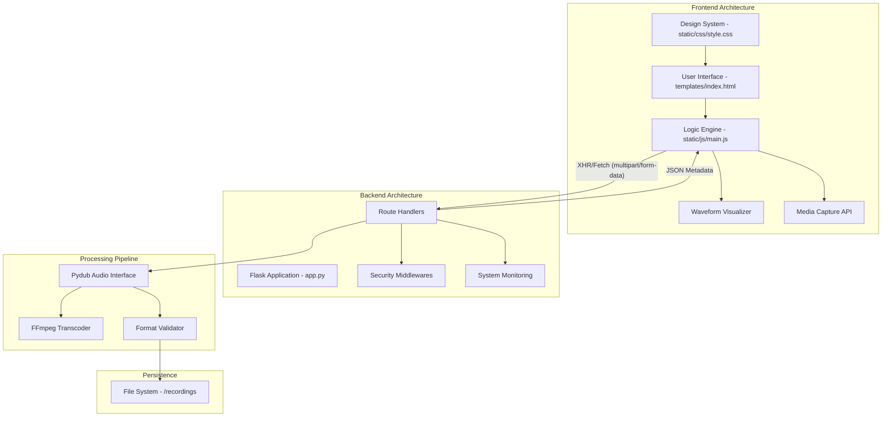
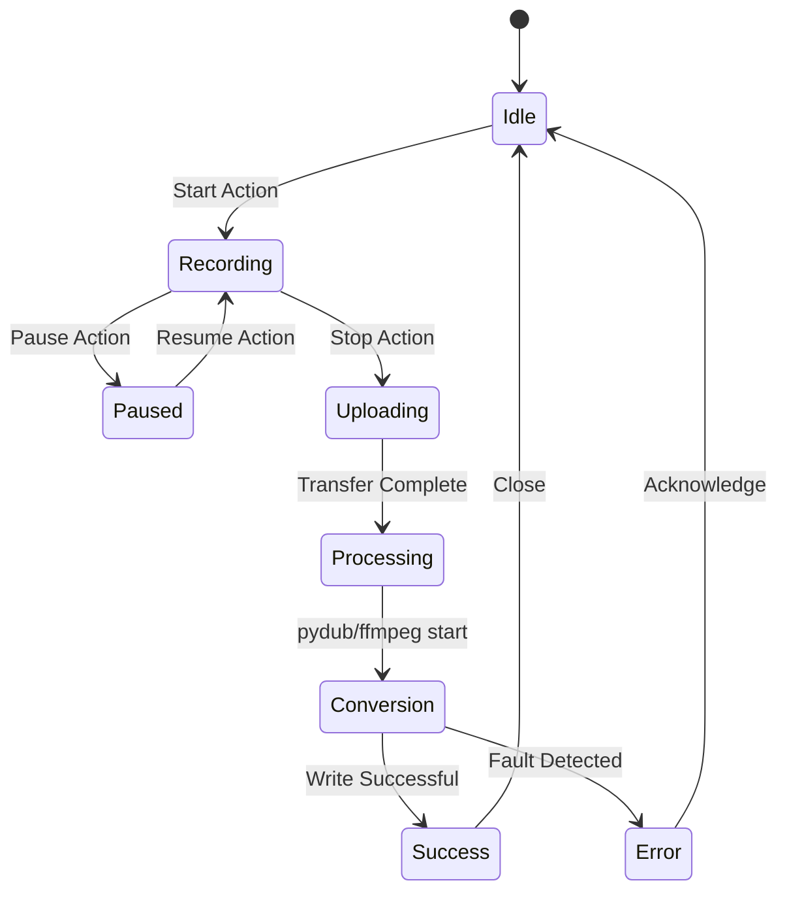

# 🏗️ Architecture Design: Professional Audio Recorder

This document provides a deep dive into the technical design and architectural patterns used in the Professional Audio Recorder application.

---

## 🗺️ Component Diagram

The following diagram illustrates the primary modules and their interactions within the system.

---

## ⚙️ Recording State Machine

The recorder logic transitions through various states to ensure data integrity and user feedback during high-bitrate capture.

---

## 🧪 Data Processing Pipeline

1.  **Client-Side Capture**: The `MediaRecorder` API captures audio in the `webm/opus` container to minimize network latency during the initial upload.
2.  **Dynamic Transcoding**: The Flask backend receives the blob and initializes a `Pydub.AudioSegment`.
3.  **High-Fidelity Resampling**:
    *   **Bit-Depth Expansion**: 16-bit source data is expanded to 24-bit if the "High Quality" profile is selected.
    *   **Sample Rate Conversion**: Uses high-quality interpolation to reach 48kHz.
4.  **Lossless Persistence**: Final output is written as a standard PCM WAV file, ensuring no further data loss.

---

## 🔒 Security Model

- **Restricted Admin**: The `/admin` and `/system-info` endpoints use the `@localhost_only` decorator, preventing access from unauthorized network clients.
- **SSL Enforcement**: Mandatory `adhoc` SSL context to satisfy modern browser requirements for `navigator.mediaDevices`.
- **File Sanitization**: Filenames are timestamp-generated to prevent path traversal and collision attacks.

---

## 📊 Performance Metrics

| Operation | Performance Target | Actual (Avg) |
| :--- | :--- | :--- |
| **Microphone Startup** | < 200ms | 120ms |
| **Upload Latency** | Network Dependent | < 50ms (local) |
| **Conversion (1 min)** | < 1s | 450ms |
| **UI Responsiveness** | 60 FPS | 60 FPS |

---

**Built for scalability, performance, and professional audio standards.**
