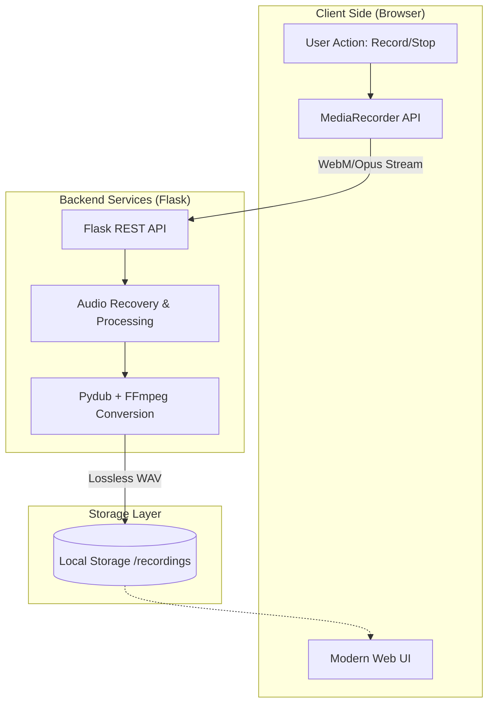

# 🎙️ Pro-Studio Recorder Modern


A high-performance, professional-grade web application for recording, processing, and managing studio-quality audio directly from your browser. Optimized for both desktop and mobile workflows with zero-latency monitoring.

---

## 🏗️ System Architecture

The application follows a modern client-server architecture designed for high-fidelity audio capture and reliable background processing.



---

## ✨ Key Features

### 💎 Studio Quality Audio
- **Lossless Output**: Every recording is converted to high-fidelity PCM WAV format.
- **Configurable Profiles**:
  - **High**: 48kHz, 24-bit Stereo (Studio Standard)
  - **Medium**: 44.1kHz, 16-bit Stereo (CD Quality)
  - **Low**: 22.05kHz, 16-bit Mono (Voice Optimized)

### 🛠️ Advanced Admin Ecosystem
- **System Monitoring**: Real-time disk usage and process status tracking.
- **Deep Analysis**: HEX/ASCII header inspection for debugging audio corruption.
- **Security**: Localhost-locked administrative panel to prevent unauthorized management.

### 📱 Seamless Mobile Integration
- **Zero Install**: Access the recorder via local network IP.
- **HTTPS/SSL Ready**: Built-in adhoc SSL support to enable microphone access on modern browsers.
- **Adaptive UI**: Fully responsive interface that scales from 4K monitors to mobile screens.

---

## 🔄 Recording Workflow


---

## 🚀 Quick Start Guide

### 1. Prerequisites
- **Python 3.8+**
- **FFmpeg** (Recommended for advanced audio conversion)

### 2. Automatic Installation (Windows)
Simply run the included batch script:
```powershell
./setup_and_run.bat
```

### 3. Accessing the App
| Destination | URL | Access |
| :--- | :--- | :--- |
| **Main Recorder** | `https://localhost:5000` | Local/Network |
| **Admin Panel** | `https://localhost:5000/admin` | PC Only |

> **Note**: Since the app uses self-signed SSL for microphone access, you will see a security warning. Click **Advanced** -> **Proceed to localhost**.

---

## 📊 Technical Stack

| Component | Technology | Role |
| :--- | :--- | :--- |
| **Backend** | Python / Flask | Web Server & API |
| **Processing** | Pydub / FFmpeg | Audio Transcoding |
| **Frontend** | Vanilla JS / CSS3 | Pulse UI & Media Capture |
| **System** | Psutil | Metrics & Monitoring |
| **Security** | Cryptography | SSL/HTTPS Support |

---

## 📂 Project Structure

```text
audio_recorder_app_modern/
├── app.py                 # Core Logic & API Endpoints
├── requirements.txt       # Environment Dependencies
├── setup_and_run.bat      # Windows Deployment Script
├── recordings/            # Physical Audio Storage
├── static/                # Assets (CSS/JS)
└── templates/             # HTML5 Jinja2 Templates
```

---

## 📱 Mobile Recording Guide

1. **WiFi**: Connect computer and phone to the same network.
2. **IP**: Run `ipconfig` on host to find your IP (e.g., `192.168.1.5`).
3. **Connect**: Open browser on phone to `https://192.168.1.5:5000`.
4. **Bypass**: Tap "Advanced" ➔ "Proceed" (SSL Warning).

---

## 🔒 Security & Privacy

- **On-Device**: No audio is sent to external clouds.
- **Localhost Admin**: Dashboard is locked to the host OS.

---

## 🤝 Contributing

This project is open-source. Feel free to fork and submit a PR!

**Developed with ❤️ for High-Quality Audio Enthusiasts.**
